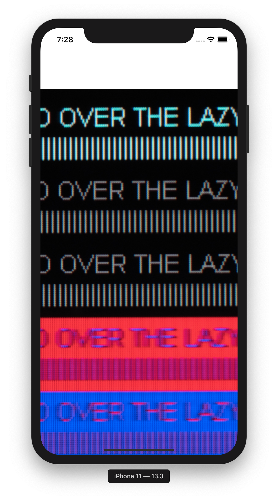

[[_TOC_]]
# Overview

I don't know about anyone else but I'm finding the new [SwiftUI](https://developer.apple.com/xcode/swiftui/) for Apple/iOS a bit disconcerting.   It seems to be jumping on the current 'functional/declarative' programming bandwagon.   This would not be so bad except for the dearth of good information and weak documentation and sometimes it seems like a downright 'downgrade' from the existing UIKit.

For example, the [ScrollView](https://developer.apple.com/documentation/swiftui/scrollview), which replaces the existing [UIScrollview](https://developer.apple.com/documentation/uikit/uiscrollview).   The old UIScrollview appears to have a much deeper functionality and greater accessibility into its internals and workings.    By contrast the SwiftUI Scrollview exposes much less and kinda has this "pay no attention to the man behind the curtain" thing going on.   Add to that the documentation has this annoying habit of repeating all of the entries from the base class.

All that said, I've been working on a project that requires displaying of arbitrary images and had to painstakingly cobble together a view to do that.   This seems to be a fairly common usecase and it might be valuable to provide it to others and to serve as a good example for working with SwiftUI

While I've done alot with ObjC, C++, C# and python, I'm still new to swift, so bear with me.

I will acknowledge that Apple seems to be providing much better underlying support for working with images.   The SwiftUI [Image](https://developer.apple.com/documentation/swiftui/image) view appears to be handling large images in a much more straightforward manner.   A big improvement over earlier versions in iOS apps where you had to manually break images into 'tiles'.  

# TODO
* See if we can get a more obvious project organization
* Add a class that can handle multiple images as a grid/strip

# Screenshot

